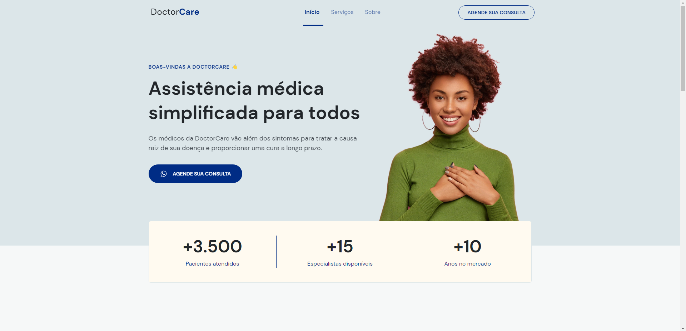
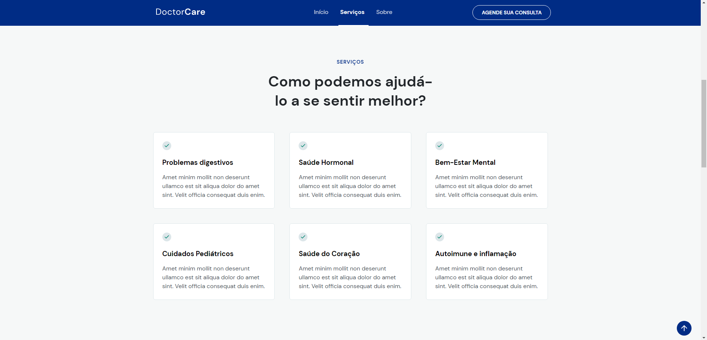
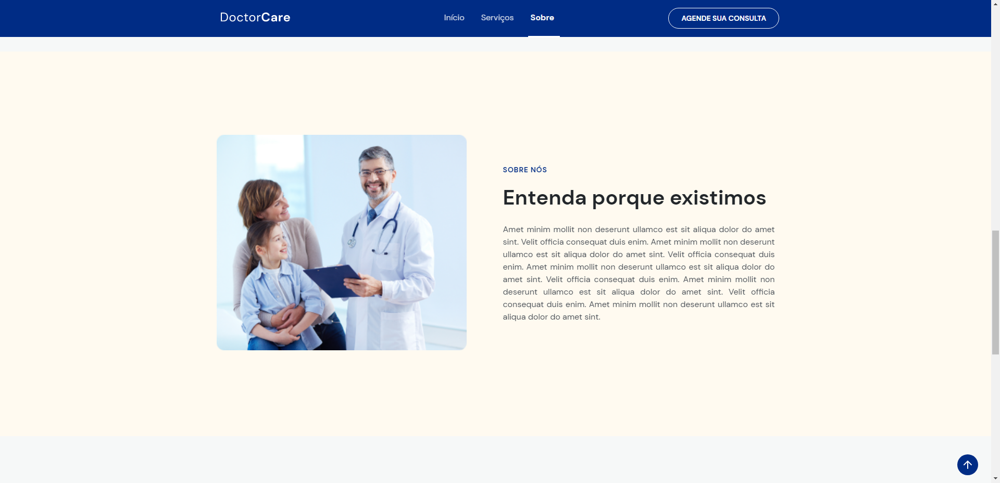
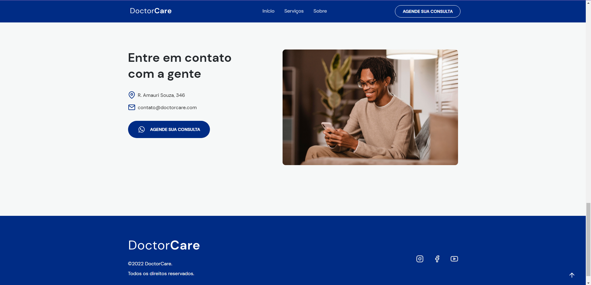

## MODERN WEB PAGE
## _Project developed during NLW8, promoted by [Rocketseat](https://www.rocketseat.com.br/)_

## Tech
  The page was developed using the techs:
- [HTML 5](https://developer.mozilla.org/pt-BR/docs/Web/HTML) - For the structure page.
- [CSS 3](https://developer.mozilla.org/pt-BR/docs/Web/CSS) - For the design of the page.
- [JavaScript](https://developer.mozilla.org/pt-BR/docs/Web/JavaScript) - For the behavior of the page.
- [Figma](https://www.figma.com/file/CSWWouZAWODrKuBLZe8QE3/DoctorCare-(Community)?node-id=0%3A1) - For the model template.

## Application preview
## _Home page_

## _Services page_

## _About page_

## _Contact page_

## _Mobile version_

## _Menu mobile version_

